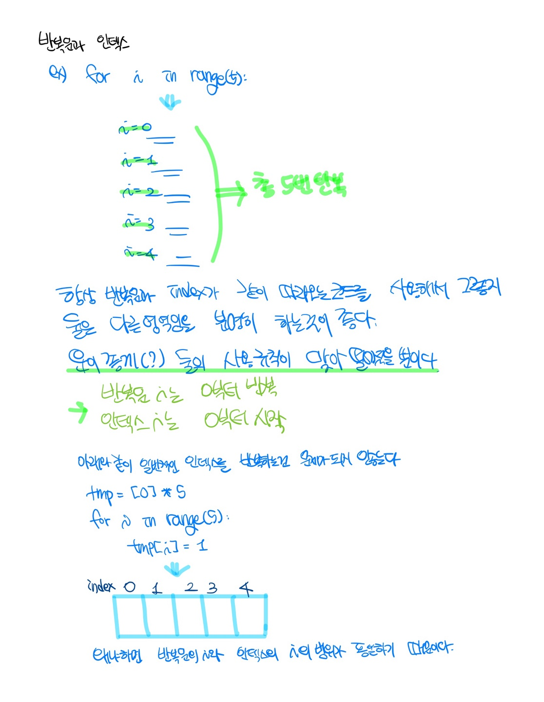
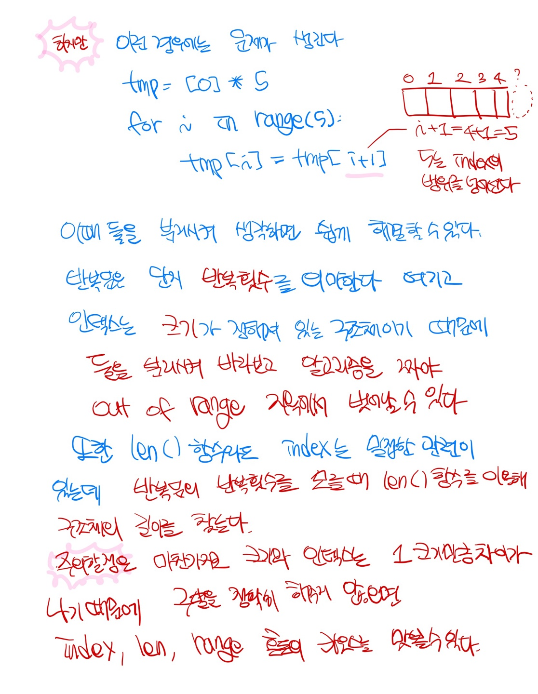

# 2021.06.26 알고리즘 문제풀이

일요일 코딩 테스트 때문에 발등에 불이 떨어졌지만, 저의 페이스를 유지하고자 차근 차근 문제를 풀어보겠습니다😭

사실 실력이 없어서 그래용 ㅎㅎ...


## bj2941

string 문제도 이렇게 버벅대다니....ㅠㅠㅠㅠ

- 내 풀이

  ```python
  sentence = input()
  idx = 0
  cnt = 0
  while idx < len(sentence):
      if sentence[idx] == 's' or sentence[idx] == 'z':
          idx += 1
          cnt += 1
          if sentence[idx] == '=':
              idx += 1
          else:
              cnt += 1
              idx += 1
      elif sentence[idx] == 'c':
          idx += 1
          cnt += 1
          if sentence[idx] == '=' or sentence[idx] == '-':
              idx += 1
          else :
              cnt +=1
              idx +=1
      elif sentence[idx] == 'l' :
          idx += 1
          cnt += 1
          if sentence[idx] == 'j' :
              idx += 1
          else:
              cnt += 1
              idx += 1
      # nljj 이 tc에서 문제 
      elif sentence[idx] == 'n' :
          idx += 1
          cnt += 1
          if sentence[idx] == 'j':
              idx += 1
          else:
              cnt += 1
              idx += 1
      elif sentence[idx] == 'd':
          idx += 1
          cnt += 1
          if sentence[idx] == '-':
              idx += 1
          elif sentence[idx] == 'z':
              idx +=1
              if sentence[idx] == '=':
                  idx += 1
              else:
                  cnt += 2
                  idx += 1
      else :
          idx += 1
          cnt += 1
  print(cnt)
  
  ```

  제가 짠 코드입니다.

  일단 다른 부분에선 ok 됐는데 중간에 `nljj`와 같이 처음엔 첫글자 다음에 바로 규칙이 적용되는 문자열이 나오면 예외처리를 해주지 못합니다..ㅠ.ㅠ

- 다른 사람 문제풀이

  ```python
  sentence = input()
  croa = ['c=', 'c-', 'dz=', 'd-', 'lj', 'nj', 's=', 'z=']
  
  for i in croa :
      sentence = croa.replace(i, '*')
  print(len(sentence))
  ```

  충격...`replace`라는 함수 이용해서 문자 조합을 하나의 문자로 바꾸고 그 결과를 찾아낸다는게 정말..

  `java`나 `c++`코드도 찾아봤는데 대부분 `replace`라는 함수를 제공하고 있고 다들 그걸 사용하셨더라구요..

  - `replace(해당 단어, 대체 단어)` : 해당단어를 찾아 뒤의 대체 단어로 바꿔주는 함수


​		위의 방법대로 사용할 경우 알파벳을 공유하고 있는 문자는 리스트에 들어가 있는 단어들의 순서에 따라 결과가 달라질텐데..? 라고 생각했는데 다행이도 문자의 마지막 알파벳과 문자의 처음알파벳을 공유하는 경우 (예를 들어 `ljn`이런 경우에 해당 단어가 `lj`, `jn`인 단어)가 없어서 그런 예외처리는 신경 써 주지 않아도 될 것 같습니다.


## bj1316

배열의 인덱스를 얼마나 잘 사용할 수 있는지에 대한 문제인 것 같습니다.

항상 버벅대는거 보니까 저는 반복문 - 인덱스에 굉장히 취약하다는 걸 알고 있는데요.

이번 기회를 통해 확실히 짚고 넘어가겠습니다!! 






- 나의 풀이 

  - 저는 알파벳을 담을 배열과 그 알파벳의 배열에 접근하기 위해 아스키코드를 이용해 문자를 숫자로 바꿔주었습니다. 

  ```python
  n = int(input())
  # 그룹단어 갯수
  cnt = n
  for i in range(n):
      # 알파벳을 담을 인덱스
      alpha = [0] * 26
      # 단어
      word = input()
      # 단어의 길이만큼
      for j in range(len(word)):
          if j < len(word)-1  :
              if alpha[ord(word[j])-97] == 0 :
                  if word[j] != word[j+1] :
                      alpha[ord(word[j])-97] = 1
              else :
                  cnt -= 1
                  break
          else:
              if alpha[ord(word[len(word)-1])-97] != 0 :
                  cnt -= 1
  print(cnt)
  ```

  

- 다른사람 풀이

  ```python
  n = int(input())
  
  group_word = 0
  for _ in range(n):
      word = input()
      error = 0
      for i in range(len(word)-1):  # 인덱스 범위 생성 : 0부터 단어개수 -1까지 
          if word[i] != word[i+1]:  # 연달은 두 문자가 다른 때,
              new_word = word[i+1:]  # 현재글자 이후 문자열을 새로운 단어로 생성
              if new_word.count(word[i]) > 0:  # 남은 문자열에서 현재글자가 있있다면
                  error += 1  # error에 1씩 증가.
      if error == 0:  
          group_word += 1  # error가 0이면 그룹단어
  print(group_word)
  ```

  위와 같은 문제풀이는 하나의 새로운 단어를 잡아서 그 단어가 뒤에 있는지를 i를 옮겨 가면서 검사를 했네요.

  같은 문제이지만 count함수를 사용해서 문제를 풀 수도 있군요 ㅎㅎ

  - `count(찾는 단어)` : count 함수는 찾는 단어나 숫자가 있으면 return으로 갯수(int)를 반환해 주는 내장 함수입니다. 

