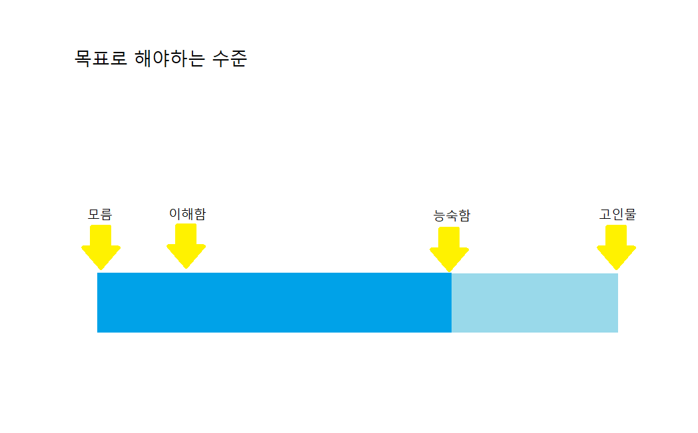

# TIL 

가장 먼저 만든 레파지토리였는데 가장 늦게 README를 쓰는 것 같네요😂

알고리즘 문제풀이를 위한 폴더입니다! 

알고리즘을 잘 못하니까 더더욱 안하게 되는 것 같아요🙄

올해 목표는 이 TIL파일로 올해 잔디를 매일매일 심는게 목표입니다🤩

정말 악순환이더라구요 ^^...

언젠간 스트레스 받을 때 알고리즘 문제를 풀면서 스트레스 푼다는 말을 하는 날이 오겠죠😭

그렇게 될 날을 기약하면서 제 스스로 규칙을 정해 보려고 합니다! 

## 1. 알고리즘을 잘 하기 위한 준비

### 1. 능숙함을 목표로

같은 문제를 풀 때 소모되는 에너지가 잘하는 사람과 그냥 하는 사람은 다릅니다.

얼만큼 능숙하느냐가 중요합니다.

- 쉬운 문제 vs 어려운 문제
  - 중수 이상이 되지 않을 때는 쉬운 문제를 더 우선적으로 많이 풀어야 합니다. (나야나..🙄)
  - 정올 begginer 부터 차근차근 문제를 풀어나가기 
    - 난이도 별로 많이 나오고 
    - 어디서 틀렸는지도 나온다.
- **매일 쉬운 문제 두 문제씩풀기**
  - 난이도가 쉽던, 어렵던 매일 두 문제씩 풀자! 
  - 보통 컨디션 : 매일 두 문제
  - 좋은 컨디션 : 최대한 많이 풀자 
  - 💙기본기가 착실히 쌓이면 능숙도가 많이 쌓일 것입니다.🤴🏻(알고리즘 뿌시자)

## 2. 마인드 컨트롤

### 세레모니에 흔들리지 말자

알고리즘 준비는 멘탈관리가 중요하다.

**주변 사람들 / 채팅창이 아니라 내가 생각하는 내 실력에 집중하자.**

사실 저는 제가 생각해도 실력이 너무 부족하다고 느끼니까 더 하기 남들과 비교하면서 알고리즘을 하기 싫어하는 것 같습니다.😭

언제까지 못한다고 하기엔 이젠 코딩에서 발을 빼긴 늦은 것 같습니다.🤐

실력이 만들어 졌으면 결과가 잘나오지만 실력이 아직 안만들어 졌다면 결과가 잘 나오지 않습니다.

#### 코딩실력만 좋으면, 무엇이던 괜찮습니다. 

#### 코딩실력이 낮으면, 무엇이던 안좋습니다. 

코딩실력이 낮으면, 주력언어를 바꾸려고 시도를 많이 합니다.(뼈맞았습니다.제 이야기입니다..😭😭😭)

사실 코딩 실력이 좋으면, 언어는 무엇으로 하던 상관없습니다.

대신 python, C++, java 셋 중 하나로 하면 됩니다.

### 문제를 풀다 막히면 어떻게 할까요?

문제를 풀면 느낌이 옵니다.

1️⃣**"건들지 못하겠다", "무엇을 요구하는지 모르겠다", "왠지 풀이를 보면 알 것 같은데...."**

​		-> 풀이를 보지말고, 더 쉬운 문제를 푸십시오

2️⃣**"성능 최적화를 더 해야한다"**

 		-> 한 두시간 집중하여 고민 후, 풀이를 조금만 보고 다시 생각해 봅시다.

##### p.s 코딩 테스트가 현업에 도움이 되나요?🤔

조~금 됩니다.

하지만 디버깅 하는 실력이 확실이 빠릅니다.

그 외는 현업 지식이 더 도움이 됩니다.(준비할게 점점 더 많아 지는군요......🤢)

### 그럼 코테는 왜 보나요?

1️⃣**코딩 기본기 / 문제해결력**

현업자 입장에서는 신입이 프로그래밍을 떠듬떠듬하면 정말 답답합니다. (이거 내이야기 같은데.........🤮)

반면, 기본기가 탄탄하면 가르치는 맛이 납니다.

2️⃣ **다른 스팩에 비해 더 유용합니다.**

IQ검사(인적성검사) 보다 유용합니다.

토익, 해커톤경력 보다 더 유용합니다.

### 🏃🏻‍♂️올라가는 속도 차이는 재능입니다.

하지만 오래 공부해서 그 차이를 좁히면 됩니다.

포화 상태로 올라가는 건 똑같습니다. 단지 시간이 다를 뿐입니다. 

## 3. 문제풀기 전 항상 설계하기

설계 == 계획 

설계는 어떻게 구현할지에 대한 계획입니다.

#### 작은 문제를 설계로 잘 풀 수 있어야 큰 문제를 풀 수 있습니다.

#### 문제이해 -> 설계

문제 이해 단계에서 n값을 보면 강력한 힌트를 얻을 수 있습니다. 

#### 기본기가 튼튼한 상태에서 팁은 갑옷을 입는 느낌으로 가는 겁니다. 

순차탐색 

주사위

순열, 조합

트리DFS

그래프 DFS 

능숙하게 할 수 있어야 할 수있다고 말하는 겁니다.(다 못하넹...😭😰😱)

시원시원하게 되면 기본기가 튼튼한 상태입니다.

그 상태에서 고급 조건을 코드로 옮겨야 체력 분배가 완전하게 됩니다. 

### 이해 -> 설계 -> 구현 -> 디버깅

#### 이해

한문장도 이해못한  문장이 없도록 문제를 완벽하게 이해하는 게 중요 

n 값에서 힌트를 얻기

입, 출력 데이터  검증 

#### 설계 

계획 세우기 

손검증한 데이터 기반으로 시물레이션 

#### 구현 

입증이 되는 것 같으면 구현 하면서 테스트 반복 

#### 디버깅 

 

## 4. 업로드 일자

저는 모르고리즘이라는 언택트 알고리즘 스터디를 진행하고 있습니다. 

사실 기본기가 탄탄하지 않은 상태에서 계속 쌓아 올리려고 하다 보니 결국 이도저도 안되버리려서 작년 한달은 쉬었습니다......😢(지친것도 있습니다ㅎ)

하지만 저는 역시 강제성이 없으면 여전히 아무것도 안하더군요 ㅎㅎ...

**그래서 강제성을 좀 주고자 모르고리즘 모여서각자코딩(이하 모각코) 시간에 무조건 한 문제씩 풀어서 푸쉬하겠습니다!**

#### 매주 오후 10시에 push합니다.😈

작심3일이 되지 않도록 힘내겠습니다!

